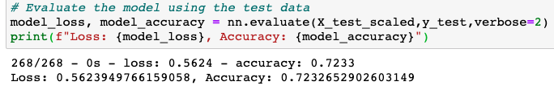

# Neural_Network_Charity_Analysis

## Overview
The purpose of this analysis is to to create a binary classifier that predicts the success of different types of startups if funded. This task was accomplished by using pandas to organize the data and tensorflow neural networks for predictions in jupyter notebook.

## Results

### Data preprocessing
- The "is successful" column was used as the target for the model
- The features columns are:
  - application type
  - classification
  - use case
  - status
  - income amount
  - special conisderations
  - organization
  - ask amount
- The removed columns that are neither targets nor features are the "name" column and the "EIN" column

### Compiling, training, and evaluating the model
- I was not able to increase the model performance to the 75% target. These were the optimization tried:
- For the first optimization, I dropped the "organization" column. The model statistics are as follows:

- For the second optimization, I changed the hidden layer activation functions from relu to tanh. The model results are as follows:

- For the third optimization, I added a third hidden layer and increased the amount of neurons to 100 for the first layer, 80 for the second layer, and 30 for the third layer. The results are as follows:

### Summary
Overall, the models performance was only able to increase when changing the hidden layer activation functions to tanh. Adding more layers and neurons decreased model accuracy, as did reducing the amount of features. Using a logistic regression model could provide better results because it can better predict the probability of the input data belonging to one of two groups. The input data would be the features, and the groups would be if the startup was successful or not. Logistic regression models are designed using the sigmoid function, which is perfect for this type of binary classification.
